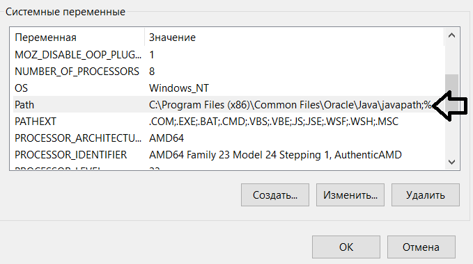
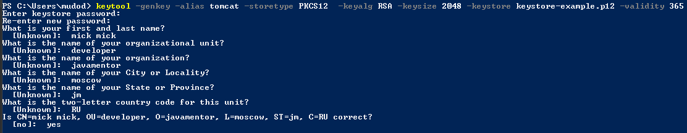
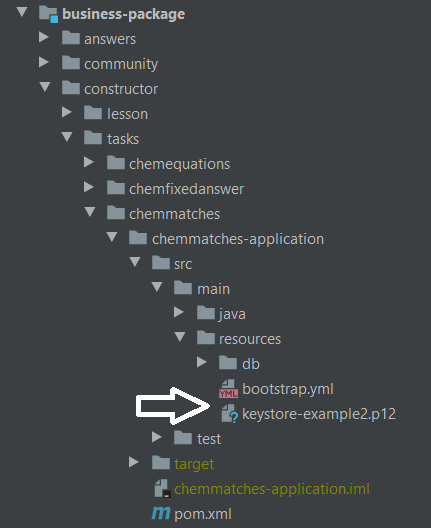
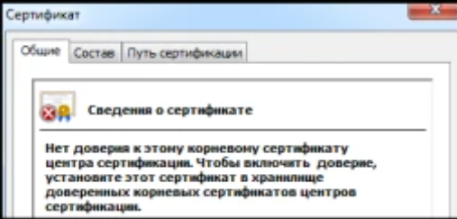
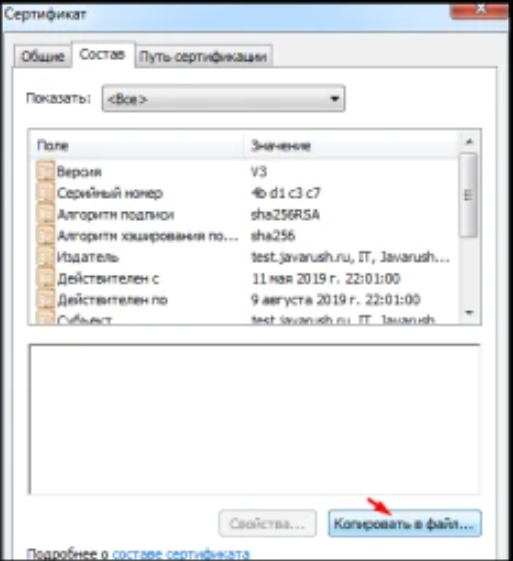

#Как использовать SSL в своем микросеврисе


Для начала нужно убедиться, что каталог, в котором находится исполняемый файл keytool, находится в вашей %PATH%переменной среды.

Например:



В рамках работы с сертификатами обычно 
используется контейнер PKCS 12 для хранения ключей и 
сертификатов.
Для работы с хранилищем JDK поставляется с 
консольной утилитой keytool.
Создадим самозаверяющий сертификат:

```
keytool -genkey -alias tomcat -storetype PKCS12  -keyalg RSA -keysize 2048 -keystore keystore-example.p12 -validity 365
```

Сертификат создается в формате X.509. В этом формате в качестве идентификатора владельца используется Distinquished Name или просто DN в формате X.500. Этот же формат идентификации объектов используется в LDAP-протоколе или в SNMP. Distinquished Name задается в виде разделенных через запятую атрибутов :

+ CN — common name (имя владельца);
+ OU — organizational unit or department/division (департамент/отдел);
+ O — organization name (наименование организации);
+ L — locality or city (город/местоположение);
+ ST — state or province;
+ C — country, two chars (страна).

Например:



Созданный нами сертификат помещаем в директорию микросервиса:



Далее нам необходимо предоставить порт сервера,
 путь к файлу хранилища ключей, пароль хранилища ключей,
  тип хранилища ключей и имя псевдонима ключа в файле application.yml

Пример для chemmatches-application:

```
server:
  port: 0
  ssl:
    key-store: keystore.p12
    key-store-password: springboot
    keyStoreType: PKCS12
    keyAlias: tomcat
  servlet:
    context-path: /chemmatches-application/
```

Затем рекомендуется выполнить для необходимого нам микросервиса

```
mvn clean install
```

Готово! Теперь, чтобы вызвать эндпоинт микросервиса нужно обращаться через https:

```
https://localhost:63732/chemmatches-application/v1.0
```
Итак, наш сервер уже готов работать по HTTPS, но клиент ему не доверяет. Почему? 
Причина в том, что данный сертификат является самоподписанным (Self-signed Certificate). 
Под самоподписанным SSL сертификатом понимают сертификат открытого ключа, изданный и подписанный тем же лицом, которое он идентифицирует. То есть его не выдавал никакой уважаемый центр сертификации (CA, он же Certificate Authority). 
Центр сертификации (Certificate Authority) выступает как доверенное лицо и похож на нотариуса в обычной жизни. Он заверяет, что выданные им сертификаты надёжны. Услуга выдачи сертификатов такими CA является платной, поэтому утеря доверия и репутационные риски никому не нужны.
По умолчанию есть несколько центров сертификации, которым доверяют. Этот список доступен для редактирования. И управление списком центров сертификации в каждой операционной системе свой.



Давайте добавим сертификат в доверенные, как указано в сообщении об ошибке.

Для этого, сначала, скачаем сертификат:



В OS Windows нажмём Win+R и выполним ```mmc``` для вызова консоли управления. Далее нажмём Ctrl+M для добавления раздела "Сертификаты" в текущую консоль.

Далее в подразделе "Доверенные корневые центры сертификации" выполним 

```Действия / Все задачи / Импорт```. 

Выполним импорт файла, скачанного ранее в файл.

Браузер мог запомнить прошлое состояние доверия к сертификату. 
Поэтому, перед открытием страницы нужно выполнить рестарт браузера. 
Например, в Google Chrome в адресной строке необходимо выполнить chrome://restart.

Если мы всё сделали правильно, то увидим успешное обращение к нашему серверу по HTTPS


